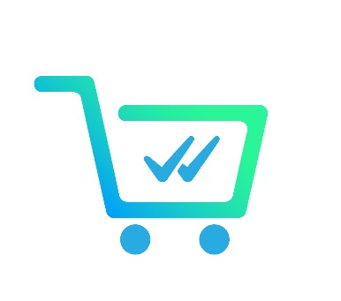

# Nosso Carrinho - Hackarocket Zenvia - Team 36



#### Link da demo: [hackarocket-team36](https://hackarocket-team36.herokuapp.com/admin)

[Link do diagrama do Zenvia Flow](./assets/diagrama_zenviaflow.png)

O projeto consiste numa API que serve de backoffice para o Chatbot de compra coletiva desenvolvido no Zenvia Flow.

É responsável por cuidar das integrações dos pedidos, montar as compras coletivas de acordo com
os pedidos dos usuários, notificar os usuários e enviar os links de pagamento quando os lotes de compra coletiva estão completos.

Por meio da API, o nosso usuário consegue realizar algumas operações de atualização de endereço, solicitação de pedido.

Pelo acesso ao `/admin` podemos acompanhar e gerenciar os dados da plataforma, como por exemplo:
* Visualizar pedidos pagos
* Acompanhar quais compras coletivas estão prontas para serem enviadas aos fornecedores
* Visualizar os usuários, endereços de entrega, e telefones de contato

## Ferramentas utilizadas
* [MongoDB](https://www.mongodb.com/): banco de dados não relacional para prototipação mais rápida
* [Rails_admin](https://github.com/sferik/rails_admin): biblioteca para criação de interfaces de administração
* [Pagarme](https://pagar.me/): ferramenta que utilizamos para fazer os pagamentos dos pedidos

## Requirements
* Rails 6

## Setup
Instale as dependências com:

```
bundle install && yarn install
```

## Docker
_Obs:_ você precisa de uma instância do MongoDB local, pode ser iniciada com:
```
docker run --name my_local_mongo -p 27017:27017 -d mongo
```

Se quiser, pode rodar diretamente o `docker-compose up -d` para iniciar os serviços relevantes.
